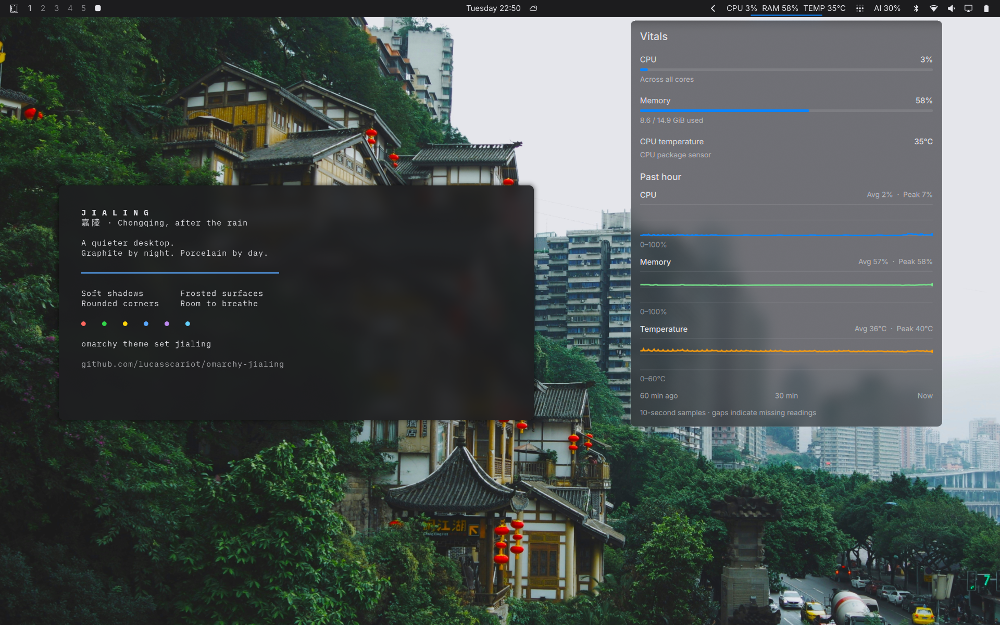
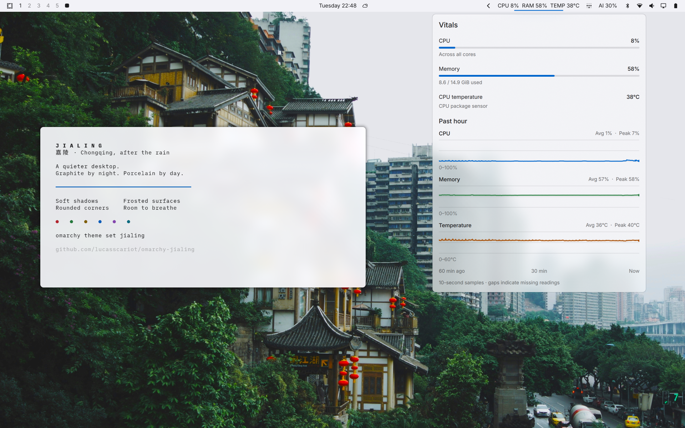
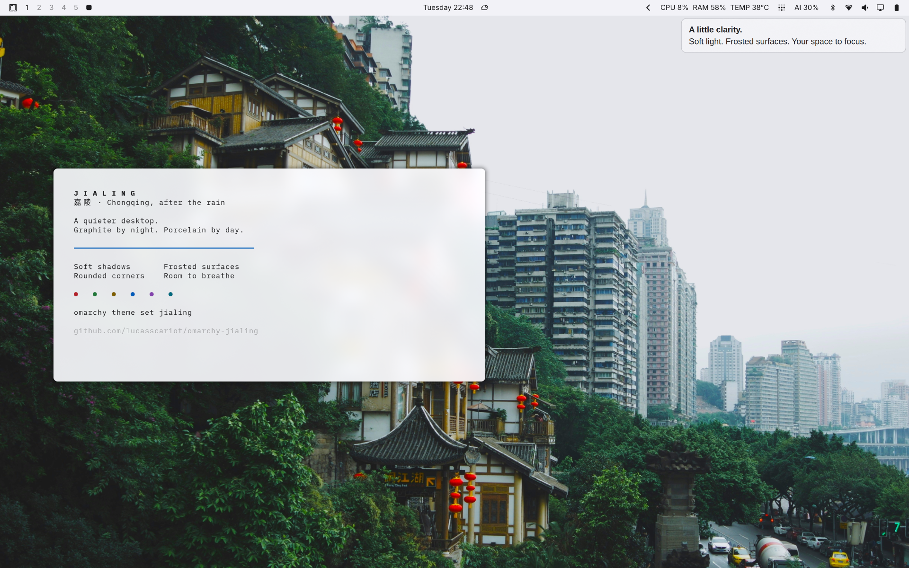

# Jialing

A dark and light Omarchy theme named after the Jialing River in Chongqing. Graphite and porcelain surfaces, blue accents, translucent panels, soft window shadows, and a borderless lock-screen input.

## Quick install

On Omarchy 4 with Lua Hyprland, paste this into a terminal:

```bash
curl -fsSL https://raw.githubusercontent.com/lucasscariot/omarchy-jialing/main/install.sh | bash
```

Installs both variants and applies the dark theme. Rerun the same command to update; an already selected Jialing light theme stays light. Existing settings are backed up, and the installer prints the restore path. No sudo is needed.

**Prefer light?**

```bash
curl -fsSL https://raw.githubusercontent.com/lucasscariot/omarchy-jialing/main/install.sh | bash -s -- --variant light
```

**Switch automatically with daylight?** This opts into hourly approximate location lookup through ipapi.co, which sees your public IP:

```bash
curl -fsSL https://raw.githubusercontent.com/lucasscariot/omarchy-jialing/main/install.sh | bash -s -- --daylight --auto-location
```

This also sets up the isolated Python dependency and enables the user timer. If location lookup is unavailable, the current theme remains until a location is available; a [fixed fallback](#fixed-location-or-offline-fallback) can also be configured.

The installer requires Git and Python 3.11+, normally available on supported Omarchy installations. It downloads this repository into a temporary directory, runs the [installer](install.py), then removes the temporary checkout. [Read the bootstrap script](install.sh) before running it if you prefer. Fonts, wallpaper, and companion plugins are separate; see the options below.

## Preview

### Graphite · dark



### Porcelain · light



<details>
<summary>Notification styling</summary>



</details>

Real desktop captures staged on a separate workspace. The terminal contains demo text; Vitals shows live system readings. [Omarchy Vitals](https://github.com/lucasscariot/omarchy-vitals) and the personal bar arrangement shown are separate from the theme. Wallpaper: [Wallhaven exl2m8](https://wallhaven.cc/w/exl2m8), shown in context; the original image is not included as a theme asset.

## Appearance

| | Dark | Light |
|---|---|---|
| Desktop palette | Graphite | Porcelain |
| Bar panels and notifications | Translucent charcoal | Translucent white |
| Window corners | 8 px | 8 px |
| Inner / outer gaps | 5 / 10 px | 5 / 10 px |
| Inactive window opacity | 85% | 85% |
| Window animations | Disabled | Disabled |

Both variants include native `preview.png` screenshots, so Omarchy’s theme selector shows the matching desktop UI instead of only a wallpaper.

Both variants include shell, Hyprland, and Ghostty styling. Ghostty uses iA Writer Mono S, 9 pt, with 14 px padding. The optional system font profile uses Inter for the UI. Native Omarchy templates generate other supported application colors from `colors.toml`.

## Compatibility

Tested on **Omarchy 4.0.3-1**, with its Lua Hyprland configuration and Quickshell desktop. Earlier Hyprland `.conf` setups and Waybar are not supported.

This repository contains **two native themes and optional setup tools**. Install with the script below, then select either variant through Omarchy's normal theme picker or `omarchy theme set`.

`omarchy theme install <repo-url>` does not install this collection: the variants live in subdirectories, and Omarchy regenerates Lua and terminal configuration for cloned themes. The installer explicitly copies the reviewed assets into user theme directories. It never changes packaged Omarchy files.

Existing global appearance rules can override theme styling. Review your `~/.config/hypr/looknfeel.lua` if gaps, borders, or blur differ from the table. Personal keybindings, window layouts, bar layout, and plugins remain under your control. [Omarchy Vitals](https://github.com/lucasscariot/omarchy-vitals) is a separate companion plugin.

## Manual install and options

Requires Python 3.11+ and an active Omarchy session. The basic installer uses only Python's standard library.

```bash
git clone https://github.com/lucasscariot/omarchy-jialing.git
cd omarchy-jialing
python install.py --variant dark
```

Use `--variant light` for the light palette. Add `--no-apply` to write files without switching the desktop. Each install prints a JSON backup path **before** applying the theme, so it remains available if desktop application fails.

```bash
omarchy theme set jialing
omarchy theme set jialing-light
```

All `install.py` options also work with the one-line installer: append `-s --` after `bash`, followed by your options.

| Option | Effect |
|---|---|
| `--variant light` | Apply the light theme |
| `--wallpaper /path/to/image.jpg` | Add a local image to both variants |
| `--profile` | Apply the optional global font and Ghostty profile |
| `--daylight --auto-location` | Set up and enable automatic switching with IP location |
| `--daylight --no-auto-location` | Use an existing fixed-location configuration |
| `--no-apply` | Install files without changing the desktop or activating the timer |
| `--restore /path/to/backup` | Restore a previous installation's files |

Unlike the manual Python installer, the one-line bootstrap provisions Astral and activates the timer when `--daylight` is requested. With `--no-apply`, it provisions dependencies and writes the files but leaves timer activation to you.

### Wallpaper

Existing backgrounds are preserved. To add a local image to both variants:

```bash
python install.py --wallpaper /path/to/city.jpg --variant light
```

The original Chongqing wallpaper is [Wallhaven exl2m8](https://wallhaven.cc/w/exl2m8). It is not bundled: its redistribution license has not been verified. Obtain an image you are entitled to use and pass its local path. Fonts are also not bundled.

### Optional font profile

Install [Inter](https://github.com/rsms/inter) and [iA Writer Mono](https://github.com/iaolo/iA-Fonts) first, then:

```bash
python install.py --profile --variant dark
```

This adds an included Fontconfig rule file, sets GTK 3/4's font to `Inter 11`, and lets the active theme supply Ghostty font, padding, and opacity. Other font aliases, GTK setting values, and terminal shortcuts are retained. GTK settings files are reformatted; backups retain their original bytes. Existing local Ghostty appearance values otherwise take precedence over the theme. Restart affected applications to pick up font changes.

The profile is global and remains in effect when selecting another theme. Use the printed backup to undo it. Missing fonts fall back through Fontconfig; the installer does not download fonts or change the default terminal.

## Herdr

Both variants include matching Herdr custom palettes for surfaces, text, tabs,
and status colors. After installing Jialing, opt into synchronization:

```sh
omarchy hook install theme-set ~/.config/omarchy/themes/jialing/herdr-theme-hook
python3 ~/.config/omarchy/themes/jialing/herdr-theme.py
```

This uses Herdr's supported `[theme.custom]` overrides and live config reload,
connected through Omarchy's `theme-set` hook. The Python synchronization script
is a Jialing integration, not an upstream Herdr feature. It follows manual and
daylight switches between Jialing variants without restarting panes. Other
Omarchy themes leave the last Herdr palette in place.

Shortcuts, plugins, and non-theme settings are preserved. The original Herdr
configuration is backed up once to `~/.config/herdr/config.toml.before-jialing`.
The palettes are custom overrides, not entries in Herdr's built-in theme selector.
If changing `colors.toml`, update the corresponding `herdr.toml` as well.

To disable synchronization, remove
`~/.config/omarchy/hooks/theme-set.d/herdr-theme-hook`. To restore the original
appearance, copy the `[theme]`, `[theme.custom]`, and `[ui].accent` settings from
the backup into your current Herdr config, then run `herdr server reload-config`.

## Automatic daylight switching

The optional scheduler checks once a minute. Sunrise selects `jialing-light`; sunset selects `jialing`. Astral calculates sun times locally. Polar day/night use solar elevation.

Use a persistent virtual environment; the generated service remembers the interpreter used to run the installer:

```bash
python -m venv ~/.local/share/jialing-daylight/venv
~/.local/share/jialing-daylight/venv/bin/python -m pip install -r requirements.txt
```

### Approximate current location

The following command **opts into contacting ipapi.co hourly**. The provider sees your public IP. An IP-derived city may be inaccurate, especially with a VPN. The scheduler stores only city, coordinates, timezone, lookup time, and a generic failure message locally; it does not store your IP.

```bash
~/.local/share/jialing-daylight/venv/bin/python install.py --daylight --auto-location --no-apply
systemctl --user daemon-reload
systemctl --user enable --now jialing-daylight.timer
systemctl --user start jialing-daylight.service
```

Select either Jialing variant before starting the service. Selecting another theme pauses switching and location lookups. A manual choice between the two Jialing variants is corrected on the next check; stop the timer to hold a specific variant:

```bash
systemctl --user stop jialing-daylight.timer
```

Use `disable --now` instead of `stop` to keep it off across logins.

### Fixed location or offline fallback

Create `~/.config/omarchy/jialing-daylight.json` with your coordinates and an IANA timezone. Paris is an example, not a built-in default:

```json
{
  "city": "Paris",
  "latitude": 48.8566,
  "longitude": 2.3522,
  "timezone": "Europe/Paris",
  "auto_location": false
}
```

Run the installer with `--daylight --no-auto-location --no-apply` to use only the configured location, then enable the timer as above. With `auto_location: true`, these coordinates are the fallback if no cached IP location exists. Failed lookups retain the last valid cached location and retry after an hour. Without a usable location, the scheduler reports an error and leaves the desktop unchanged.

### Inspect

```bash
~/.local/share/jialing-daylight/venv/bin/python ~/.local/share/jialing/daylight.py --status
~/.local/share/jialing-daylight/venv/bin/python ~/.local/share/jialing/daylight.py --status --refresh-location
journalctl --user -u jialing-daylight.service -n 20
```

`--status` does not contact the network unless `--refresh-location` is supplied and auto location is enabled. `--status --now 2026-12-15T12:00:00+01:00` inspects a specific timestamp without changing the desktop. Cache: `~/.local/state/omarchy/jialing-location.json`.

## Update and restore

Rerun the one-line command with the same options, or pull a manual checkout and rerun its installer. Installed theme assets are replaced; previous bytes are backed up. Extra files and backgrounds are retained. Daylight config values survive updates, including the existing lookup preference unless explicitly overridden.

```bash
git pull --ff-only
python install.py --variant light
```

For scheduler updates, use its virtual-environment Python with `--daylight --no-apply`, then run `systemctl --user daemon-reload`.

The one-line installer can also restore a backup without keeping a clone:

```bash
curl -fsSL https://raw.githubusercontent.com/lucasscariot/omarchy-jialing/main/install.sh | bash -s -- --restore /path/printed/by/installer
```

To restore, first select an available theme outside Jialing. If restoring scheduler files, stop the timer and service before restoring:

```bash
systemctl --user disable --now jialing-daylight.timer
systemctl --user stop jialing-daylight.service
python install.py --restore /path/printed/by/installer
systemctl --user daemon-reload
```

Restore checks every destination and backup before writing. It refuses if a managed file has been edited or deleted since installation, or if a destination is a symlink. Resolve those changes manually rather than discarding them. Restore backups in reverse order after different updates. Restore reinstates old file contents and removes newly installed files; empty directories, location cache, backups, service activation state, and the selected desktop theme are not restored. Re-enable a previously configured timer manually if needed. File writes are atomic individually, not a crash-proof multi-file transaction.

Backups are under `~/.local/state/jialing/backups/`, in private directories. Do not publish backups or location settings. The installer honors XDG config/data/state paths for file installation; Omarchy itself currently expects its standard home paths, so use standard paths for a live desktop.

## Development

```bash
python -m venv .venv
.venv/bin/python -m pip install -r requirements.txt
.venv/bin/python -m unittest discover -s tests -v
```

Tests exercise the installer CLI in temporary homes and the scheduler CLI/main entry point. Network responses and desktop processes are mocked where needed; tests never change the real desktop or perform location lookups. Coverage includes repeated installation, preservation of settings and wallpapers, restore conflicts, incomplete backups, sunrise/sunset boundaries, seasonal/polar behavior, missing/invalid locations, cache failures, hourly refresh, and manual theme overrides.

See [REVIEW.md](REVIEW.md) for review scope and manual checks. Code and theme configuration are MIT licensed; Omarchy-derived shell configuration retains the upstream copyright in [LICENSE](LICENSE).
