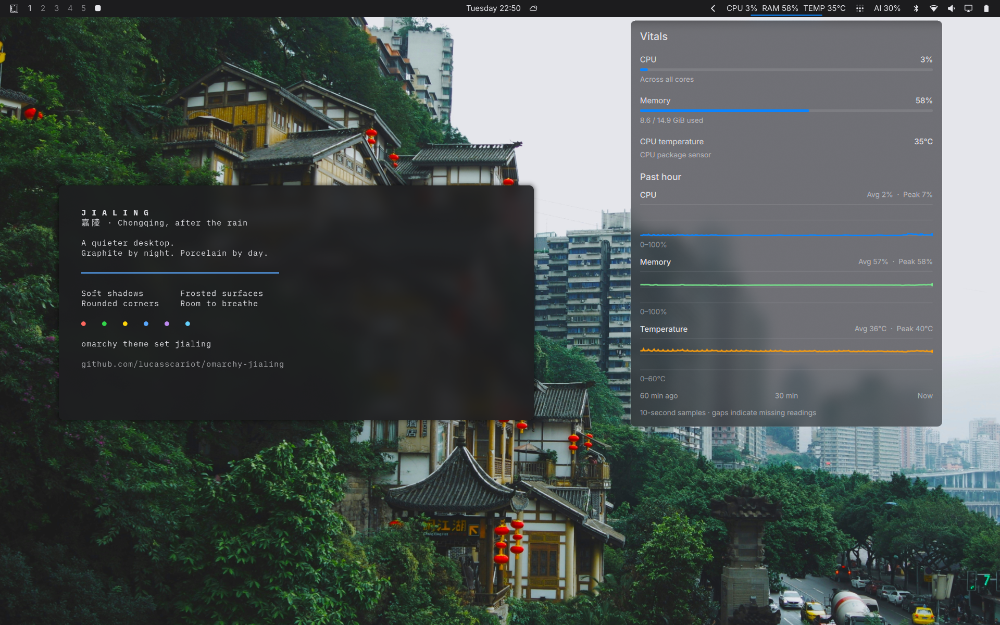

# Jialing

A dark Omarchy theme with graphite surfaces, blue accents, a red/orange outline on the focused window, subtly rounded windows without shadows, and opaque shell panels.



## Standard Omarchy install

On Omarchy 4:

```bash
omarchy theme install https://github.com/lucasscariot/omarchy-jialing.git
```

Omarchy reads the palette and shell colors from this repository and generates terminal and Hyprland config from its current templates. The red/orange focus gradient follows the palette; border width, corner radius, and animations follow Omarchy's defaults. This path does not install the optional Herdr hook.

## Full local appearance

To include Jialing's 1 px focus border, 5 px corners, disabled animations, and optional Herdr colors, use the local installer:

```bash
curl -fsSL https://raw.githubusercontent.com/lucasscariot/omarchy-jialing/main/install.sh | bash
```

The installer copies the theme into `~/.config/omarchy/themes/jialing`, backs up any files it replaces, and selects Jialing. It needs Git and Python 3.11+. The backup path is printed before the theme is applied. Re-run the command to update the theme. Use either install method for a given theme directory; the local installer does not modify a Git clone created by `omarchy theme install`.

To inspect or run the installer locally:

```bash
git clone https://github.com/lucasscariot/omarchy-jialing.git
cd omarchy-jialing
python3 install.py
```

`python3 install.py --no-apply` installs the files without changing the current desktop theme. Switch later with `omarchy theme set jialing`.

The package contains one dark theme: `colors.toml`, `shell.toml`, a selector preview, and optional local appearance files. Omarchy generates Ghostty's colors from `colors.toml`. It keeps your existing wallpaper. To add one, place an image in `~/.config/omarchy/backgrounds/jialing/` and select it through Omarchy.

Ghostty padding is a personal terminal setting. To keep the previous Jialing spacing with either install method, add this to `~/.config/ghostty/config`:

```ini
window-padding-x = 14
window-padding-y = 14
```

Jialing also contains optional Herdr colors in `herdr.toml`. The installed Omarchy `theme-set` hook applies them to Herdr when Jialing is selected and removes them when another theme is selected, preserving the rest of your Herdr settings. If Herdr is not installed, the hook does nothing.

## Restore

Use the backup path printed by the installer:

```bash
python3 install.py --restore /path/to/backup
```

Restore checks for edits made after installation before changing any files. If Jialing is active, select another theme first so the Herdr hook removes its colors. The installer does not modify packaged files under `/usr/share/omarchy/`.

## Development

```bash
python3 -m unittest discover -s tests -v
bash -n install.sh
```

See [REVIEW.md](REVIEW.md) for the small manual desktop check. Code and theme configuration are MIT licensed; Omarchy-derived shell configuration retains the upstream copyright in [LICENSE](LICENSE).
